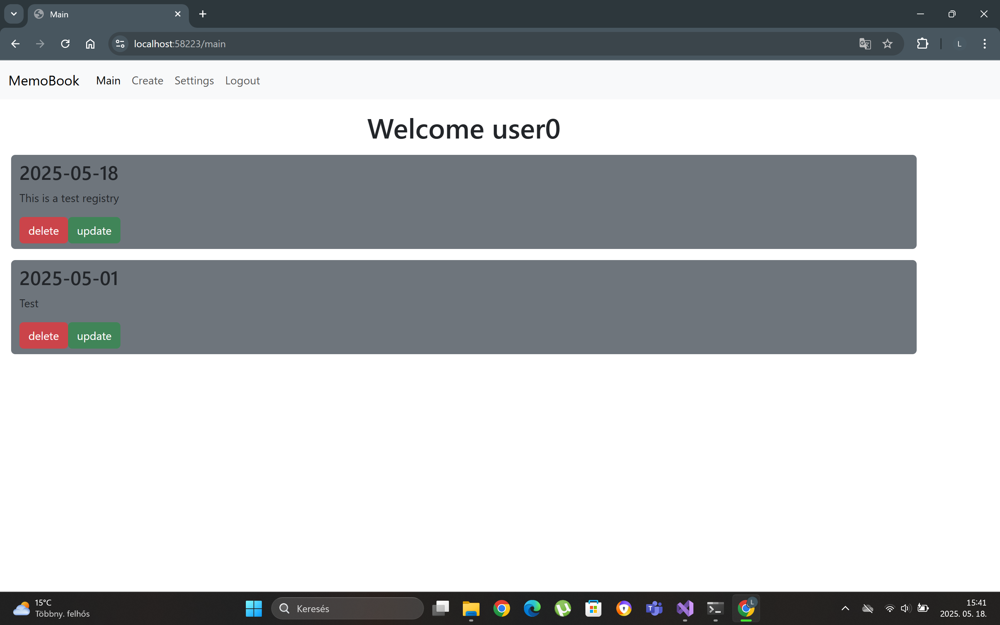
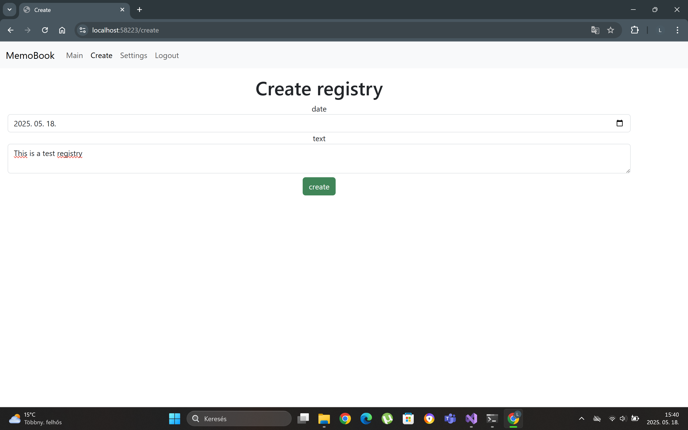
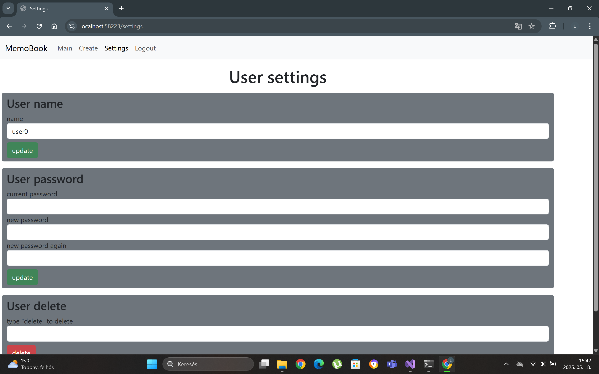
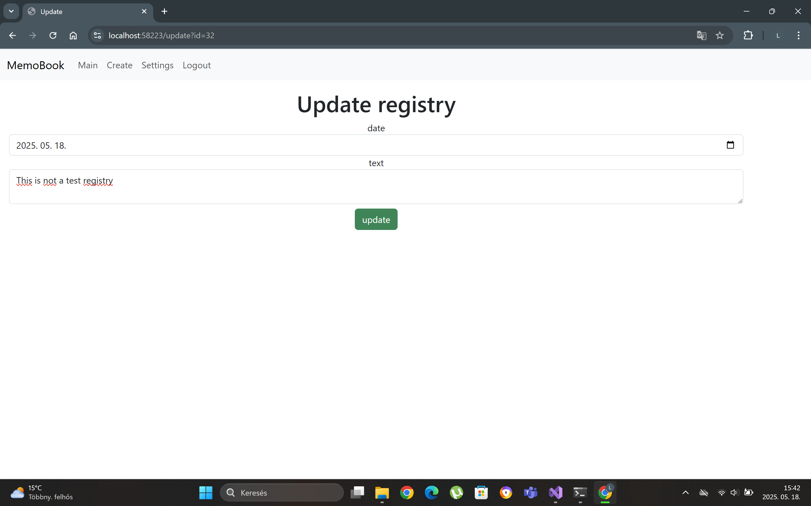

# MemoBook

## Overview
MemoBook is a digital memory book website designed for recording memories, much like a diary. The application is developed in F# using WebSharper technology. Behind the website, there is a MySQL server, which is accessed through an API, allowing data to be stored on a server.

## Motivation
I created this website because I believe it is important that memories are not lost due to the limitations of human memory. In the past, during my parents' time, memory books were very popular, and my mother often told me stories about them. This inspired me to create an application that serves the same purpose.

## Functions

- Creating, modifying, and deleting users

- Listing, creating, modifying, and deleting memory entries

## Pages

### Login

### Main
On the main page, the entries we have created are displayed, and we have the option to edit or delete them.

### Create

### Settings

### Update

## Try live
Click [this](https://memobook20250518150207-gggdeaehh7a4e3b2.germanywestcentral-01.azurewebsites.net/) link to try live the application.
